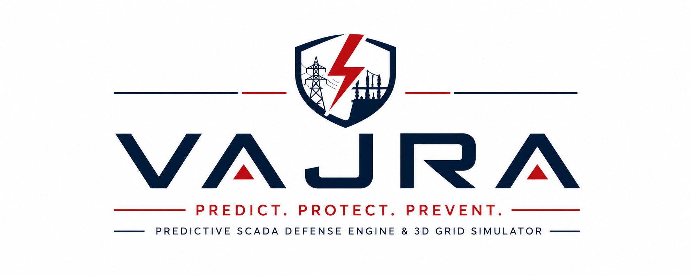
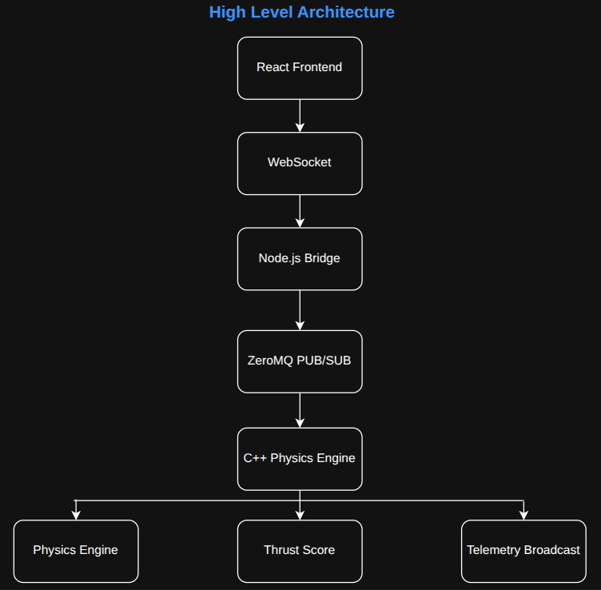
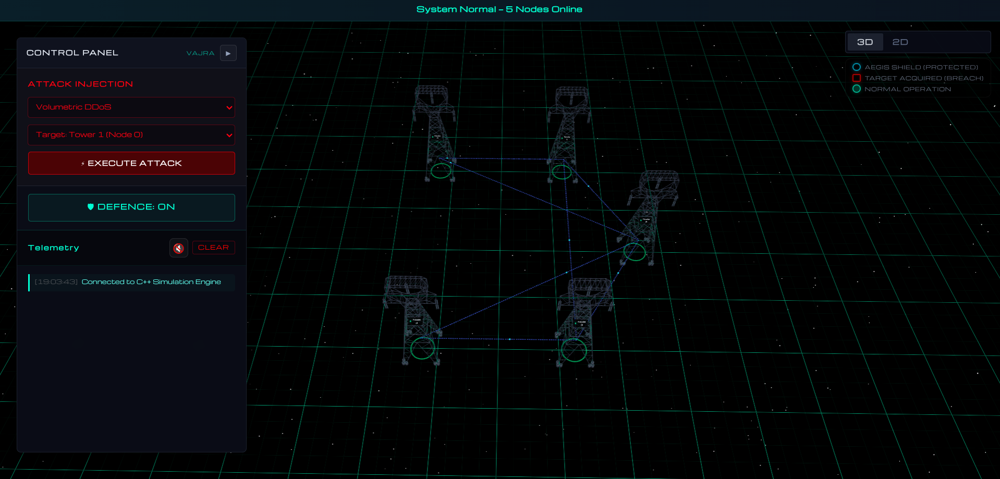
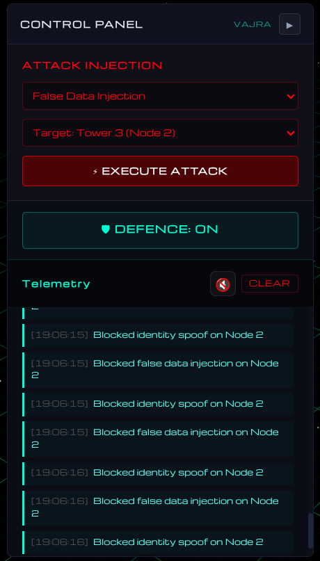
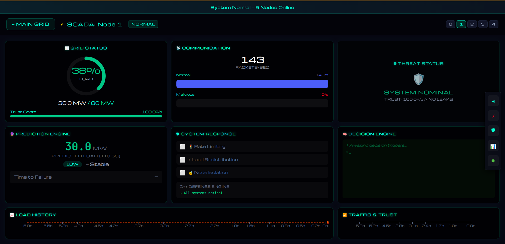
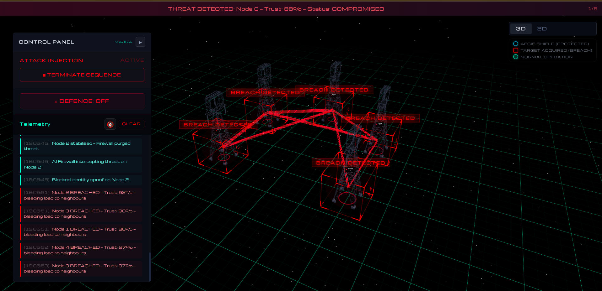
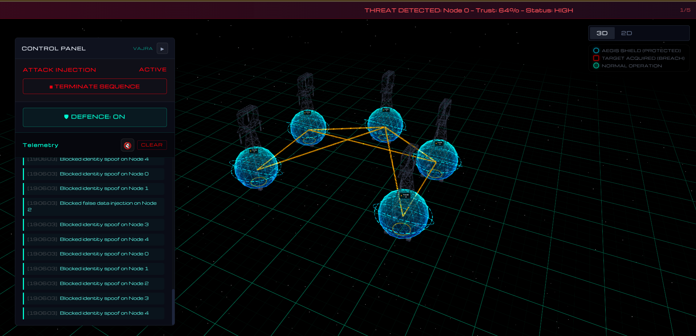

<p align="center">
  
</p>

<h1 align="center">
⚡ VAJRA
</h1>

<h3 align="center">
Cyber-Physical Digital Twin for Critical Infrastructure Defense
</h3>

<p align="center">
A Predictive SCADA Defense Engine & 3D Grid Simulator
</p>

<p align="center">


</p>

---

# Table of Contents

- [Project Overview](#project-overview)
- [Why This Matters](#why-this-matters)
- [Demo](#demo)
- [Key Features](#key-features)
- [System Architecture](#system-architecture)
- [Project Structure](#project-structure)
- [Threat Model](#threat-model)
- [Defense Pipeline](#defense-pipeline)
- [Screenshots](#screenshots)
- [Tech Stack](#tech-stack)
- [Installation](#installation)
- [Running the System](#running-the-system)
- [Future Improvements](#future-improvements)
- [Team](#team)
- [License](#license)

---

# Project Overview

Modern power grids are controlled by **Industrial Control Systems (ICS)** and **SCADA** infrastructure. While these systems were engineered for reliability, many legacy deployments were never designed to withstand sophisticated cyber attacks.

**VAJRA** is a real-time cyber-physical digital twin that simulates a smart electrical grid capable of detecting, visualizing, and mitigating Industrial Control System attacks before they escalate into physical infrastructure failures.

Unlike conventional monitoring dashboards that react after damage occurs, VAJRA continuously models the physical behavior of the grid, predicts cascading failures, and automatically isolates compromised nodes before widespread outages occur.

The platform combines:

- High-frequency C++ physics simulation
- ZeroMQ distributed messaging
- WebSocket telemetry
- Interactive React Three Fiber visualization
- Live SCADA monitoring
- Predictive anomaly detection

into a single command center.

---

# Why This Matters

Cyber attacks against critical infrastructure are no longer theoretical.

Incidents such as:

- Stuxnet
- Ukrainian Power Grid Attack (2015)
- Colonial Pipeline Ransomware
- Florida Water Treatment Attack

demonstrated that malicious software can directly manipulate physical infrastructure.

A successful cyber attack can:

- Damage expensive transformers
- Overload substations
- Trigger cascading outages
- Interrupt public services
- Cause nationwide economic disruption

VAJRA demonstrates how predictive defense mechanisms can detect abnormal behavior before equipment begins failing.

Rather than responding after damage occurs, the engine predicts unsafe operating conditions and executes automated isolation strategies to maintain grid stability.

---

# Demo

<p align="center">


</p>

---

# Key Features

## ⚡ Deterministic Physics Engine

Runs a high-frequency C++ simulation that models:

- Electrical load
- Packet flow
- Capacity thresholds
- Cascading failures

No JavaScript approximations are used for simulation.

---

## 🛰 Real-Time Telemetry Pipeline

Custom Node.js bridge translates:

Browser WebSocket

↓

ZeroMQ

↓

Native C++ Engine

↓

JSON Telemetry

↓

Browser Dashboard

Achieving sub-100ms communication latency.

---

## 🌐 Interactive 3D Grid

Built using:

- React
- Three.js
- React Three Fiber

Operators navigate a fully interactive digital twin of the electrical grid while observing node status in real time.

---

## 📊 Live SCADA Dashboard

Each node exposes:

- Voltage
- Frequency
- Current Load
- Trust Score
- Packet Count
- Network Status

through interactive telemetry panels.

---

## 🛡 Predictive Defense Engine

Instead of detecting attacks after equipment fails,

VAJRA predicts failure using

```
dL/dt
```

(load derivative)

combined with

- Trust Score
- Packet Analysis
- Threshold Monitoring

to identify malicious activity.

---

## 🔴 Red Team Simulator

Built-in attack panel allows simulation of:

- Volumetric DDoS
- False Data Injection
- Packet Spoofing

Operators can observe both defended and undefended scenarios.

---

## 🎙 AI Narration

The browser announces every critical event using the Web Speech API.

Example:

> "Volumetric flood detected on Node 2. Traffic scrubbing engaged."

---

# System Architecture

<p align="center">



</p>

The platform consists of three loosely coupled services.

| Component | Responsibility |
|------------|---------------|
| frontend-react | 3D Command Center & Operator Dashboard |
| bridge-node | WebSocket ↔ ZeroMQ Translation Layer |
| backend-cpp | Physics Simulation & Defense Engine |

---

# Defense Pipeline

<p align="center">


</p>

The engine continuously monitors incoming telemetry.

Attack

↓

Packet Validation

↓

Load Analysis

↓

Trust Score

↓

Threat Classification

↓

Predictive Isolation

↓

Load Redistribution

↓

Recovery

---

# Threat Model

| Attack | MITRE ICS | Description | Engine Response |
|---------|------------|-------------|----------------|
| Volumetric DDoS | T0814 | Packet Flood | Traffic Scrubbing |
| False Data Injection | T0836 | Fake Sensor Values | Trust Score Isolation |
| Packet Spoofing | T0856 | Identity Hijacking | Link Termination |

---

# Project Structure

```text
vajra/

├── backend-cpp/

├── bridge-node/

├── frontend-react/

├── docs/

│   ├── banner.png

│   ├── demo.gif

│   ├── architecture/

│   └── screenshots/

└── README.md
```

---

# Screenshots

## 3D Command Center



---

## Attack Orchestrator



---

## Node Analysis



---

## Cascade Prediction



---

## Grid Recovery



---

# Tech Stack

| Layer | Technology |
|---------|------------|
| Simulation | C++17 |
| Backend | Node.js |
| Messaging | ZeroMQ |
| Communication | WebSockets |
| Frontend | React |
| 3D Engine | Three.js |
| Renderer | React Three Fiber |
| Charts | Recharts |
| State Management | Zustand |

---

# Installation

## Prerequisites

- C++17
- CMake
- ZeroMQ
- Node.js 18+
- npm

---

## 1. Build C++ Engine

```bash
cd backend-cpp

mkdir build

cd build

cmake ..

make

./vajra
```

---

## 2. Start Bridge

```bash
cd bridge-node

npm install

node src/aggregator.js
```

---

## 3. Start Frontend

```bash
cd frontend-react

npm install

npm run dev
```

Open

```
http://localhost:5173
```

---

# Running the Demo

### Step 1

Launch the simulation.

All five substations begin in the **Healthy** state.

---

### Step 2

Observe baseline telemetry.

Monitor:

- Voltage
- Frequency
- Trust Score
- Load

---

### Step 3

Launch an attack.

Choose:

- Volumetric DDoS
- False Data Injection
- Packet Spoofing

---

### Step 4

Watch the defense engine.

The system:

- Detects anomaly
- Predicts cascade
- Isolates node
- Redistributes load
- Announces mitigation

---

### Step 5

Analyze telemetry.

Open the SCADA panel.

Observe:

- Trust Score collapse
- Load spike
- Recovery timeline

---

### Step 6

Restore the grid.

Simulation resets to nominal state.

---

# Future Improvements

- Docker deployment
- Kubernetes orchestration
- IEC-61850 support
- Multi-grid simulation
- Distributed operator mode
- Machine Learning anomaly prediction
- Hardware-in-the-loop simulation
- Cloud deployment
- Historical replay engine
- Digital substation modeling

---

# Team

Built during **HackX 5.0**

- Lavya Jain
- Aaryamaan Rai
- Aditya Gorane

---

# License

This project is released under the MIT License.

---

<p align="center">

Built to defend critical infrastructure before failure becomes disaster.

</p>
